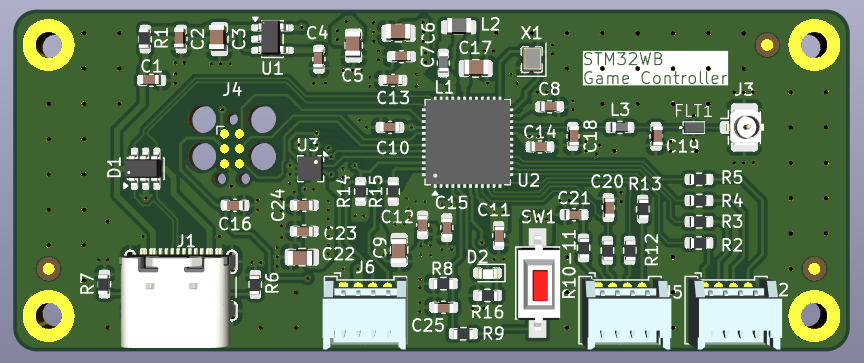

# STM32WB Game Controller

Custom microcontroller for running embedded games and other programming projects.

**Functionality:**

My original idea for this board was to create a microcontroller to run an embedded pong game I wrote a few months ago [(here)](https://github.com/BretSimmons/Embedded-Pong). I ended up adding the requried perhipherals (I2C, ADC, and 4 GPIO pins), but also UART, and a connector for an RF antenna. I wanted to create a multi purpose microcontroller I can use in future projects, and gain experience impedence matching traces for high frequencies.

**How It Works:**

The board is powered by an USB-C header and runs through ESD protection and a step down voltage regulator to power the STM32WB55xx MCU. The MCU can be programmed via either the USB or a Tag Connect header. The MCU contains several internal clocks, and I additionally included an external crystal oscillator. The perhipherals can be configured via software, and routed out via the Molex headers on the board. 

**Future Updates:**

This project is a work in progress, and there are still a couple of changes I want to make before ordering the PCB. Once I have it ordered and assembled I will update this repo with a video demo.
